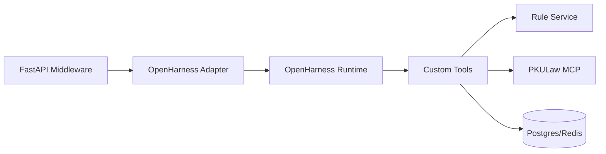
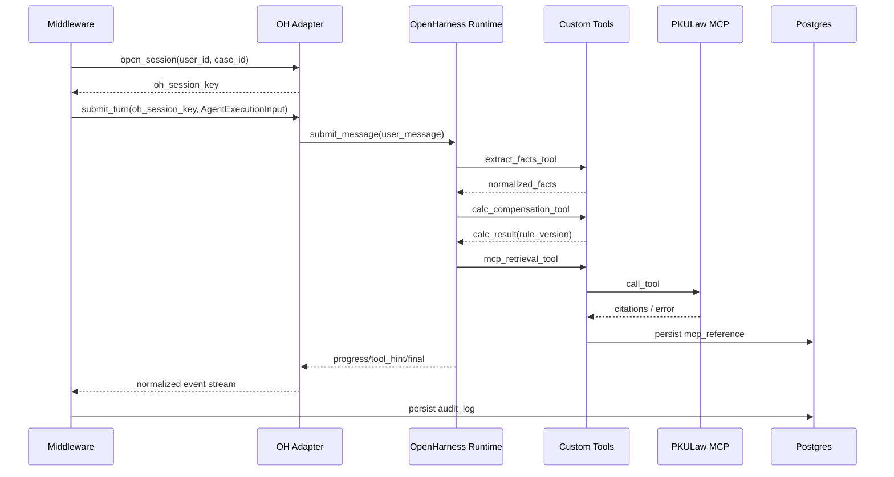

# OpenHarness 改进开发文档（Python Runtime 路线，面向智裁）

## 1. 文档目标

- 目标：定义如何在不破坏 OpenHarness 上游可升级性的前提下，完成智裁项目所需的稳定能力扩展。
- 范围：
  - 中间件适配层封装 OpenHarness Runtime。
  - 引入北大法宝 MCP 与规则优先工具链。
  - 约束 Skill 执行机制。
  - 打通数据库、审计、测试与发布流程。
- 非目标：不直接改写 OpenHarness 上游核心循环代码（除非出现阻断性缺陷）。

## 2. 总体策略：包装层优先

### 2.1 原则

1. 不 fork 核心逻辑：优先通过适配器、工具注册、技能目录、配置注入扩展。
2. 对外协议稳定：前端只面向中间件事件，不绑定 OpenHarness 原生事件。
3. 规则优先闭环：LLM 负责抽取与解释，规则层负责最终数值与边界。
4. 可回滚：任何扩展都应支持通过配置开关回退。

### 2.2 集成关系



## 3. 推荐代码组织

> 下述路径为建议工程结构，用于明确改造范围。

```text
smart-triage/
  apps/api/
    src/
      middleware/
        protocol/
        orchestration/
        adapters/openharness_adapter.py
        adapters/event_normalizer.py
        services/rule_service.py
        services/audit_service.py
  packages/agent-runtime/
    skills/
      triage_agent.md
      fact_extractor.md
      risk_agent.md
    tools/
      extract_facts_tool.py
      calc_compensation_tool.py
      mcp_retrieval_tool.py
      build_document_tool.py
      triage_score_tool.py
      persist_audit_tool.py
    profiles/
      zhicai-prod.json
```

## 4. 适配接口定义（中间件 <-> OpenHarness）

### 4.1 接口契约

```python
from collections.abc import AsyncIterator
from dataclasses import dataclass

@dataclass
class OHEvent:
    kind: str         # progress | tool_hint | final | error
    text: str
    metadata: dict

class OpenHarnessAdapter:
    async def open_session(self, user_id: str, case_id: str) -> str:
        """return oh_session_key"""

    async def submit_turn(
        self,
        oh_session_key: str,
        message: str,
        attachments: list[dict],
        metadata: dict,
    ) -> AsyncIterator[OHEvent]:
        """yield OpenHarness events"""

    async def cancel_turn(self, oh_session_key: str) -> bool:
        """cancel running turn for session"""

    async def close_session(self, oh_session_key: str) -> None:
        """release runtime resources"""
```

### 4.2 事件归一器

```python
class EventNormalizer:
    def normalize(self, oh_event: OHEvent, context: dict) -> dict:
        """
        Map OpenHarness event -> middleware standard event envelope.
        Required: request_id/case_id/session_id/turn_id/trace_id.
        """
```

| OH `kind` | 中间件事件 |
|---|---|
| `progress` | `progress` |
| `tool_hint` + 检索工具 | `evidence.retrieved`（过程态） |
| `tool_hint` + 非检索工具 | `progress` |
| `final` | `turn.final` |
| `error` | `turn.error` |

## 5. Agent 工具调用设计（含北大法宝 MCP）

### 5.1 工具分层

| 层级 | 工具 | 职责 |
|---|---|---|
| 事实层 | `extract_facts_tool` | 从自然语言提取结构化字段 |
| 规则层 | `calc_compensation_tool` | 调用规则服务计算金额和解释 |
| 检索层 | `mcp_retrieval_tool` | 调用北大法宝 MCP 拉取依据 |
| 文书层 | `build_document_tool` | 依据事实+规则填充文书模板 |
| 分流层 | `triage_score_tool` | 输出复杂度评分与推荐策略 |
| 治理层 | `persist_audit_tool` | 写审计记录与质量标记 |

### 5.2 工具调用策略

1. `extract_facts_tool` 总是先于规则计算。
2. 任何金额输出必须通过 `calc_compensation_tool`。
3. `mcp_retrieval_tool` 仅在触发条件满足时调用。
4. 敏感写操作（DB写入、外部发送）需策略拦截与审计。

### 5.3 MCP 接入规范（北大法宝）

1. 传输：`http`。
2. 鉴权：`Authorization: Bearer <PKULAW_MCP_TOKEN>`。
3. 超时：单次 `6s`，总预算 `12s`。
4. 重试：指数退避，最大 `2` 次，仅针对可重试错误。
5. 熔断：连续失败阈值触发 `rule_only_with_notice`。
6. 落库：将 `provider/tool/query/citation/url/retrieved_at` 写入 `mcp_reference`。

### 5.4 MCP 工具输出标准

```json
{
  "reference_ids": ["ref_7821001"],
  "citations": [
    {
      "title": "劳动合同法第xx条",
      "source_url": "https://...",
      "excerpt": "..."
    }
  ],
  "retrieved_at": "2026-04-18T11:03:14.110Z",
  "provider": "pkulaw"
}
```

## 6. Skill 执行机制

### 6.1 Skill 元数据规范

```yaml
name: labor.illegal_termination
when_to_use:
  - 用户主诉口头辞退/解除争议
input_requirements:
  - employment_period
  - monthly_salary
  - termination_mode
tool_allowlist:
  - extract_facts_tool
  - calc_compensation_tool
  - mcp_retrieval_tool
  - triage_score_tool
output_contract:
  must_have:
    - summary
    - rule_version
    - review_required
```

### 6.2 中间件下发 Skill 指令模板

```json
{
  "skill_plan": {
    "mode": "auto",
    "hints": ["labor.illegal_termination"],
    "allowed_skills": ["triage_agent", "fact_extractor", "risk_agent"],
    "execution_instructions": [
      "先补齐缺失字段",
      "金额以规则工具输出为准",
      "检索失败时返回降级标记"
    ]
  }
}
```

### 6.3 自动路由逻辑

1. 中间件先做案型候选（关键词 + 字段命中）。
2. 若前端提供 `skill_hint`，仅作为优先级提升，不直接强制。
3. 若命中冲突，按 `risk_policy` 选择保守技能链（优先输出缺失字段与复核提示）。

## 7. 数据库接入与边界控制

### 7.1 SQLAlchemy 模型分层

1. 领域实体：`Case/Session/Turn/FactSnapshot/CalcResult/TriageResult`。
2. 审计实体：`AuditLog`。
3. 检索实体：`McpReference`。

### 7.2 Alembic 迁移规范

1. 版本命名：`YYYYMMDDHHMM_<feature>_<entity>`。
2. 每个迁移必须提供 downgrade。
3. 灰度顺序：`dev -> staging -> prod`，生产前执行只读验证 SQL。

### 7.3 数据访问边界

1. LLM 不直接执行 SQL。
2. 所有 DB 读写通过服务层工具完成。
3. 工具层接收结构化参数，拒绝原始 SQL 字符串。

## 8. 开发流程（本地到发布）

### 8.1 环境变量基线

```bash
OPENAI_API_KEY=
OPENAI_MODEL=gpt-5.4
PKULAW_MCP_URL=
PKULAW_MCP_TOKEN=
PKULAW_MCP_TRANSPORT=http
DATABASE_URL=postgresql+psycopg://...
REDIS_URL=redis://...
OBJECT_STORAGE_ENDPOINT=
OBJECT_STORAGE_BUCKET=
APP_ENCRYPTION_KEY=
JWT_SECRET=
```

### 8.2 本地启动顺序

1. 启动 Postgres/Redis/对象存储（本地或容器）。
2. 执行 Alembic 迁移。
3. 启动规则服务（或规则模块）。
4. 启动 API 中间件。
5. 启动 OpenHarness Runtime 适配实例。
6. 运行协议与链路自检脚本。

### 8.3 CI/CD 要点

1. PR 阶段：单测 + 协议契约测 + lint。
2. 合并阶段：集成测试（含 MCP mock）。
3. 发布阶段：回归样本集 + 性能基准 + 审计字段检查。

## 9. 测试体系

### 9.1 测试分层

| 层级 | 目标 | 示例 |
|---|---|---|
| 工具单测 | 工具输入输出确定性 | `calc_compensation_tool` 对比规则样本 |
| 协议契约测 | WS/REST 字段和顺序 | `turn.submit -> turn.final` 事件链 |
| MCP集成测 | 检索成功/失败路径 | 401、超时、5xx 降级验证 |
| E2E流式测 | 全链路可用性 | 主链路 + 中断抢占 + 重连恢复 |
| 合规审计测 | 留痕完整性 | 审计字段是否含 rule_version/reference_ids |

### 9.2 强制验收场景

1. 同会话并发提交时，新请求能抢占旧请求。
2. MCP失败仍返回可执行输出（带降级标记）。
3. 高风险结果必须携带 `review_required=true`。
4. 所有最终结果都能追溯到 `turn_id + rule_version + reference_ids`。

## 10. 代码改造清单（可执行级）

### 10.1 中间件新增模块

1. 协议模型层：请求/响应 Envelope、错误码、事件模型。
2. 会话管理：`session_id -> oh_session_key` 映射、过期、抢占锁。
3. OpenHarness 适配器：实现 `open_session/submit_turn/cancel_turn/close_session`。
4. 事件映射器：OpenHarness 事件归一化与增强。
5. 审计管道：事件级日志与质量标记落库。
6. 规则服务接口：规则计算与版本注入。

### 10.2 OpenHarness 侧新增（扩展点）

1. 自定义工具模块：`extract_facts/calc_compensation/mcp_retrieval/build_document/triage_score/persist_audit`。
2. 技能目录：案型 skill + 风险 skill（含 metadata 与执行约束）。
3. Profile 与权限策略：生产 profile、工具白名单、敏感路径策略。
4. MCP 配置模板：pkulaw 的 URL/header/timeout/retry。

### 10.3 不改上游核心的明确约束

1. 不直接修改 OpenHarness QueryEngine 主循环。
2. 不重写 OpenHarness 权限系统核心模块。
3. 如出现上游缺陷，先在适配层旁路；确需补丁时单独提交 patch 分支并回灌上游。

## 11. 发布与回滚策略

### 11.1 环境策略

- `dev`：快速迭代 + MCP mock。
- `staging`：真实依赖 + 回归样本。
- `prod`：灰度发布 + 指标门禁。

### 11.2 灰度门禁

1. 协议错误率 < 0.5%。
2. `turn.final` 中 `rule_version` 缺失率 = 0。
3. MCP 降级比例在预期阈值内。

### 11.3 回滚策略

1. 优先回滚配置开关（关闭新 skill 或新工具）。
2. 次级回滚应用版本。
3. 数据层保持前向兼容，不在紧急回滚中做破坏性迁移。

## 12. 里程碑建议（对应一期）

| 周期 | 交付重点 |
|---|---|
| 1-2 周 | 适配器框架 + 协议归一化 + MCP联通性 |
| 3-5 周 | 工具链稳定（抽取/规则/检索/文书/分流） |
| 6-9 周 | 审计、权限、质检、异常降级完善 |
| 10-12 周 | 性能优化、灰度发布、回滚演练 |

## 13. 端到端时序图（OpenHarness 执行链）



## 14. 文档验收清单

1. 是否明确“改哪层、不改哪层”。
2. 是否定义适配器接口与事件归一规则。
3. 是否包含工具分层、MCP规范、Skill元数据规范。
4. 是否包含数据库边界、迁移规范、开发流程与测试矩阵。
5. 是否满足“可直接指导实现”的粒度。
