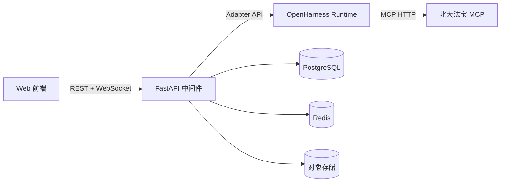
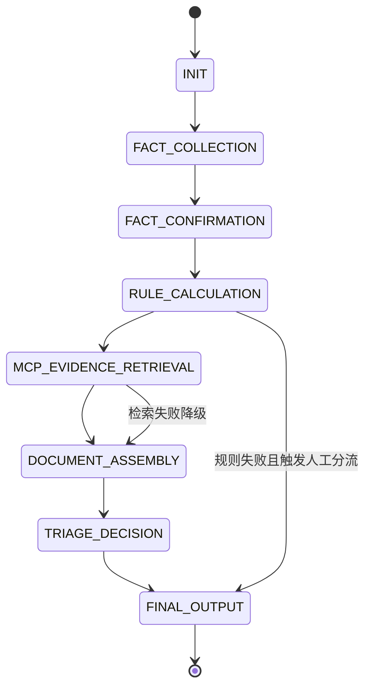
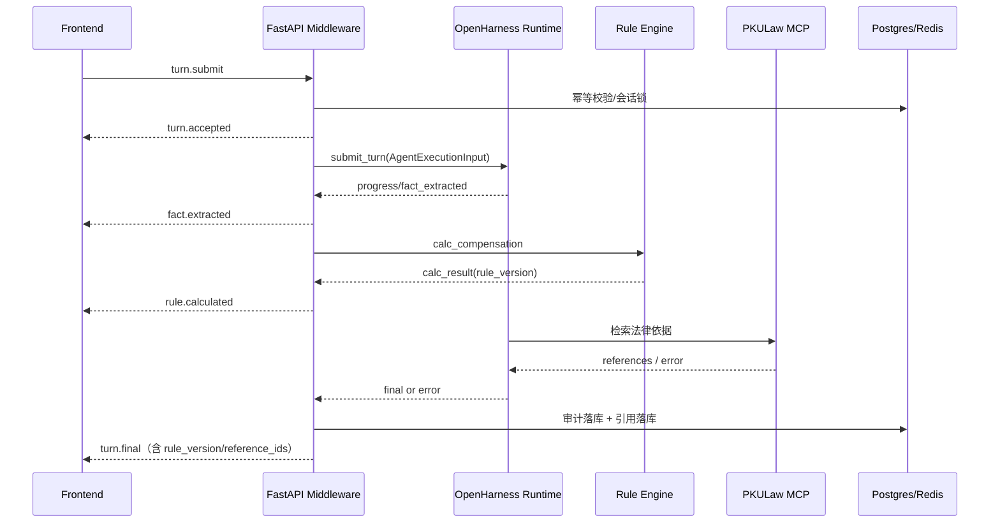

# 智裁中间件设计文档（FastAPI + OpenHarness Runtime）

## 1. 文档定位

- 文档目标：定义智裁项目在 `Web 前端 ↔ 中间件 ↔ OpenHarness` 三方之间的统一协议、状态机、数据模型与治理机制。
- 读者对象：架构评审人员、后端工程师、算法工程师、测试工程师、运维与合规团队。
- 版本：`v1.0`（一期劳动争议主链路 + 支付/HR占位接口）。

## 2. 设计原则与一期边界

### 2.1 设计原则

1. 规则优先：金额、时效、高风险判定由规则层给出最终权威结论。
2. 可追溯：所有可出街结论必须可追溯到 `rule_version` 与 `reference_ids`。
3. 异常可降级：MCP/模型异常不阻断主流程，系统回退到规则输出。
4. 协议稳定：前端只依赖中间件标准事件，不依赖 OpenHarness 原生事件。
5. 安全合规：默认最小权限、事件级审计、敏感数据分级处理。

### 2.2 一期边界

- 一期完整实现：劳动争议问诊主链路、规则计算、证据建议、文书草稿、繁简分流、律师转介。
- 一期占位实现：
  - 支付接口：仅提供协议与返回码骨架，不提供完整支付编排。
  - HR轻合规模块：仅提供 `risk-check` 协议与占位事件。

## 3. 三方职责矩阵

| 角色 | 负责内容 | 不负责内容 |
|---|---|---|
| 前端（Web/H5） | 用户交互、材料上传、事件发送、实时渲染、断线重连 | 不直接调用 OpenHarness/MCP，不做业务最终判定 |
| 中间件（FastAPI BFF+编排） | 鉴权、限流、会话、状态机、规则编排、审计、降级、协议标准化 | 不替代 OpenHarness 的推理与工具执行内核 |
| OpenHarness Runtime | 多轮上下文、工具调用、MCP接入、流式推理、技能执行 | 不直接对外暴露 API，不作为业务最终权威 |

## 4. 总体架构



## 5. API v1 总览

### 5.1 REST

1. `POST /api/v1/cases`
2. `POST /api/v1/cases/{case_id}/sessions`
3. `POST /api/v1/cases/{case_id}/generate`
4. `POST /api/v1/cases/{case_id}/triage`
5. `POST /api/v1/payments/create`（占位）
6. `POST /api/v1/payments/confirm`（占位）
7. `POST /api/v1/hr/risk-check`（占位）

### 5.2 WebSocket

- `WS /api/v1/ws/sessions/{session_id}?token={short_lived_session_token}`
- 前端上行事件：`turn.submit`、`turn.cancel`、`session.ping`
- 服务端下行事件：
  - `turn.accepted`
  - `fact.extracted`
  - `missing_fields`
  - `rule.calculated`
  - `evidence.retrieved`
  - `progress`
  - `turn.final`
  - `turn.error`

## 6. 通信协议（一）：前端 -> 中间件

### 6.1 统一 Envelope

```json
{
  "version": "v1",
  "type": "turn.submit",
  "request_id": "req_01JS9TNMZQ4XFKPH8J6P8KXYAW",
  "case_id": "case_20260418_0001",
  "session_id": "sess_01JS9TQ3J7J9GF85G0M8H3W3J6",
  "trace_id": "trace_8f2dbf6a66b64a17",
  "idempotency_key": "idem_20260418_0001_01",
  "client_ts": "2026-04-18T10:12:31.778Z",
  "payload": {}
}
```

### 6.2 字段约束

| 字段 | 类型 | 必填 | 约束 |
|---|---|---|---|
| `version` | string | 是 | 固定 `v1` |
| `type` | string | 是 | `turn.submit`/`turn.cancel`/`session.ping` |
| `request_id` | string | 是 | 每次请求唯一，推荐 ULID |
| `case_id` | string | 是 | 由后端 `POST /cases` 生成 |
| `session_id` | string | 是 | 由后端 `POST /sessions` 生成 |
| `trace_id` | string | 是 | 端到端链路追踪 |
| `idempotency_key` | string | 否 | 同一请求重发去重 |
| `client_ts` | RFC3339 string | 是 | 时间戳容差默认 ±300 秒 |
| `payload` | object | 是 | 与 `type` 对应 |

### 6.3 业务约束

1. `turn.submit` 文本长度：`1..8000` 字符。
2. 附件引用数量：每次最多 `10` 个。
3. 单次上行消息大小：默认不超过 `256KB`。
4. 时间戳超窗请求返回 `MW-4005`。
5. 重复 `idempotency_key` 返回首次结果快照，不重复执行 Agent。

### 6.4 附件引用格式

```json
{
  "attachment_id": "att_01JS9V0N8N2QPF9M1XT3K8JYAZ",
  "object_key": "cases/case_20260418_0001/uploads/att_01JS9V0N8N2QPF9M1XT3K8JYAZ.jpg",
  "mime_type": "image/jpeg",
  "size_bytes": 582341,
  "sha256": "a3f9d4..."
}
```

### 6.5 上行事件 payload 结构

#### `turn.submit`

```json
{
  "message": "公司口头辞退我，没有书面通知，工资8000，工作2年半",
  "attachments": [],
  "skill_hint": ["labor.illegal_termination"],
  "channel": "web",
  "locale": "zh-CN"
}
```

#### `turn.cancel`

```json
{
  "target_turn_id": "turn_01JS9V5YQW5F3NZG4S1P6KXK6A",
  "reason": "user_replaced_with_new_input"
}
```

#### `session.ping`

```json
{
  "heartbeat_id": "hb_20260418_101500",
  "client_rtt_ms": 23
}
```

### 6.6 前端 -> 中间件 JSON 示例

#### 示例1：普通问诊

```json
{
  "version": "v1",
  "type": "turn.submit",
  "request_id": "req_01JS9W5Y9R8R9B5S18PJ8Y3H11",
  "case_id": "case_20260418_0009",
  "session_id": "sess_01JS9W3A0YJ4KQMR2KP9RT8N0S",
  "trace_id": "trace_914c7de6f0c84bf9",
  "idempotency_key": "idem_case9_turn12",
  "client_ts": "2026-04-18T10:45:01.214Z",
  "payload": {
    "message": "我在西安一家科技公司工作两年，昨天被口头辞退。",
    "attachments": []
  }
}
```

#### 示例2：带 skill hint 的问诊

```json
{
  "version": "v1",
  "type": "turn.submit",
  "request_id": "req_01JS9W9QKHN9W2GQK91G3XHMPG",
  "case_id": "case_20260418_0010",
  "session_id": "sess_01JS9W8E2J6AXFJ1HH9AK7YV0C",
  "trace_id": "trace_14f0560ce86d496b",
  "client_ts": "2026-04-18T10:48:11.409Z",
  "payload": {
    "message": "公司一直没签合同，还拖欠工资。",
    "skill_hint": ["labor.no_contract", "labor.wage_arrears"],
    "attachments": [
      {
        "attachment_id": "att_01JS9WAA2X8H4W8KQ2Z7N6H8PE",
        "object_key": "cases/case_20260418_0010/uploads/att_01JS9WAA2X8H4W8KQ2Z7N6H8PE.png",
        "mime_type": "image/png",
        "size_bytes": 223481,
        "sha256": "9b40b2..."
      }
    ]
  }
}
```

#### 示例3：取消请求

```json
{
  "version": "v1",
  "type": "turn.cancel",
  "request_id": "req_01JS9WBQ6GX0PZ0BCZY9J9WFX9",
  "case_id": "case_20260418_0010",
  "session_id": "sess_01JS9W8E2J6AXFJ1HH9AK7YV0C",
  "trace_id": "trace_14f0560ce86d496b",
  "client_ts": "2026-04-18T10:49:17.100Z",
  "payload": {
    "target_turn_id": "turn_01JS9WBB2W7VTY15F8S8GJX6N5",
    "reason": "user_changed_intent"
  }
}
```

## 7. 通信协议（二）：中间件 -> Agent 执行输入协议

### 7.1 `AgentExecutionInput` 结构

```json
{
  "user_intent": {},
  "normalized_facts": {},
  "workflow_state": {},
  "skill_plan": {},
  "tool_policy": {},
  "retrieval_policy": {},
  "output_contract": {},
  "risk_policy": {}
}
```

### 7.2 字段定义

| 字段 | 说明 |
|---|---|
| `user_intent` | 用户意图、案型猜测、用户角色（劳动者/HR） |
| `normalized_facts` | 中间件预处理后的标准化事实（日期、金额、主体、证据） |
| `workflow_state` | 当前状态机节点、缺失字段、历史确认结果 |
| `skill_plan` | 技能执行策略，默认自动路由，支持前端 hint 软约束 |
| `tool_policy` | 工具白名单/黑名单、是否允许外部检索、敏感工具拦截 |
| `retrieval_policy` | MCP触发条件、超时、重试、降级策略 |
| `output_contract` | 约束输出必须包含字段（rule_version、reference_ids等） |
| `risk_policy` | 高风险判断阈值与 `review_required` 规则 |

### 7.3 `skill_plan` 规范

```json
{
  "mode": "auto",
  "hints": ["labor.illegal_termination"],
  "allowed_skills": [
    "triage_agent",
    "fact_extractor",
    "doc_agent",
    "risk_agent"
  ],
  "blocked_skills": ["free_chat"],
  "execution_instructions": [
    "优先完成事实抽取与缺失字段识别",
    "在规则计算前不得输出最终金额结论",
    "检索失败时返回降级说明与可执行下一步"
  ]
}
```

### 7.4 输入改写流水线

1. 文本清洗：去除无效空白、统一时间与金额格式。
2. 事实标准化：抽取 `employment_period/salary/termination_mode/evidence_status`。
3. 意图判定：案型候选 + 用户目标（咨询/生成文书/分流）。
4. 技能规划：自动选择执行 skill，前端 hint 仅提升优先级。
5. 工具策略装配：按案型注入工具白名单和风控限制。
6. 输出契约注入：强制要求 `rule_version` 与 `reference_ids`。

### 7.5 中间件 -> Agent 示例

#### 示例1：劳动争议主链路

```json
{
  "user_intent": {
    "actor": "worker",
    "primary_goal": "claim_preparation",
    "case_type_candidate": "illegal_termination"
  },
  "normalized_facts": {
    "region": "xian",
    "employment_months": 30,
    "monthly_salary": 8000,
    "termination_mode": "oral_notice",
    "has_written_notice": false,
    "evidence_status": {
      "chat_records": true,
      "attendance": false,
      "contract": false
    }
  },
  "workflow_state": {
    "current_stage": "FACT_CONFIRMATION",
    "missing_fields": ["entry_date", "social_insurance_status"],
    "confirmed_fields": ["monthly_salary", "termination_mode"]
  },
  "skill_plan": {
    "mode": "auto",
    "hints": ["labor.illegal_termination"],
    "allowed_skills": ["triage_agent", "fact_extractor", "risk_agent"],
    "blocked_skills": ["free_chat"],
    "execution_instructions": [
      "先追问缺失字段，再调用规则计算",
      "涉及金额必须以规则工具结果为准"
    ]
  },
  "tool_policy": {
    "allow": ["extract_facts", "calc_compensation", "mcp_pkulaw_search", "build_document"],
    "deny": ["raw_db_write", "shell_exec"],
    "sensitive_guard": true
  },
  "retrieval_policy": {
    "enabled": true,
    "provider": "pkulaw",
    "trigger": ["法律依据请求", "法条校核"],
    "timeout_ms": 6000,
    "max_retries": 2,
    "fallback": "rule_only_with_notice"
  },
  "output_contract": {
    "must_have": ["summary", "next_actions", "rule_version"],
    "when_retrieval_used": ["reference_ids"]
  },
  "risk_policy": {
    "high_risk_topics": ["compensation_amount", "limitation_period", "injury_level"],
    "force_review_required": true
  }
}
```

#### 示例2：HR风险提示占位链路

```json
{
  "user_intent": {
    "actor": "hr",
    "primary_goal": "risk_precheck",
    "case_type_candidate": "hr_compliance_hint"
  },
  "normalized_facts": {
    "region": "xian",
    "scenario": "resignation_notice_delivery",
    "company_size": "sme"
  },
  "workflow_state": {
    "current_stage": "FACT_COLLECTION",
    "missing_fields": ["employee_handbook_publish_proof"]
  },
  "skill_plan": {
    "mode": "auto",
    "hints": ["hr.risk_hint"],
    "allowed_skills": ["triage_agent", "risk_agent"],
    "blocked_skills": ["doc_agent"],
    "execution_instructions": [
      "输出应为风险提示，不输出法律结论性断言",
      "若缺关键字段则返回补充清单"
    ]
  },
  "tool_policy": {
    "allow": ["extract_facts", "hr_risk_check"],
    "deny": ["mcp_pkulaw_search"],
    "sensitive_guard": true
  },
  "retrieval_policy": {
    "enabled": false,
    "fallback": "local_hr_templates"
  },
  "output_contract": {
    "must_have": ["risk_summary", "fix_actions", "review_required"]
  },
  "risk_policy": {
    "force_review_required": false
  }
}
```

## 8. 通信协议（三）：Agent -> 中间件 -> 前端

### 8.1 服务端统一事件 Envelope

```json
{
  "version": "v1",
  "event": "fact.extracted",
  "request_id": "req_01JS9W5Y9R8R9B5S18PJ8Y3H11",
  "case_id": "case_20260418_0009",
  "session_id": "sess_01JS9W3A0YJ4KQMR2KP9RT8N0S",
  "turn_id": "turn_01JS9W7K8TSG0SR5K5NNYQK2HB",
  "trace_id": "trace_914c7de6f0c84bf9",
  "server_ts": "2026-04-18T10:45:03.001Z",
  "payload": {}
}
```

### 8.2 OpenHarness 事件映射

| OpenHarness 事件 | 中间件标准事件 | 说明 |
|---|---|---|
| `progress` | `progress` | 一般进度提示 |
| `tool_hint` | `progress` 或 `evidence.retrieved` | 若 tool 为检索类，映射为检索进度 |
| `final` | `turn.final` | 最终答复（已合并规则与治理约束） |
| `error` | `turn.error` | 错误事件（带错误码与降级信息） |

### 8.3 强约束（可出街结果）

1. 最终金额相关输出必须包含 `rule_version`。
2. 当触发检索时，最终输出必须包含 `reference_ids`（可空数组但必须出现）。
3. 高风险输出必须包含 `review_required` 与 `risk_label`。
4. 缺失字段场景必须返回 `missing_fields` 事件，不得直接给最终结论。

### 8.4 下行示例

#### 示例1：MCP成功

```json
{
  "version": "v1",
  "event": "turn.final",
  "request_id": "req_01JS9X4P7D8W9PZ2D62W4NFN2A",
  "case_id": "case_20260418_0013",
  "session_id": "sess_01JS9X2GTQSBGGD7VH2RQCQ0B6",
  "turn_id": "turn_01JS9X53S2X6G38A2XQX3A7R4Y",
  "trace_id": "trace_4ee3d4bda9c245d3",
  "server_ts": "2026-04-18T11:03:14.110Z",
  "payload": {
    "summary": "初步判断为疑似违法解除，建议申请仲裁并补齐入职证明。",
    "rule_version": "xian.illegal_termination.compensation.v1.2",
    "reference_ids": ["ref_7821001", "ref_7821017"],
    "review_required": true,
    "risk_label": "high",
    "next_actions": [
      "补充入职时间证据",
      "整理工资流水与沟通记录",
      "准备仲裁申请草稿"
    ]
  }
}
```

#### 示例2：MCP降级

```json
{
  "version": "v1",
  "event": "turn.final",
  "request_id": "req_01JS9X9TP64MRV8VZQ1G02XY3Q",
  "case_id": "case_20260418_0014",
  "session_id": "sess_01JS9X87ZJH7R2AMXFXA98JZRG",
  "turn_id": "turn_01JS9XA8S5R9F8KSGYVP9N2C87",
  "trace_id": "trace_bccdca6e154a4e34",
  "server_ts": "2026-04-18T11:08:29.001Z",
  "payload": {
    "summary": "检索服务暂不可用，已基于本地规则输出初步建议。",
    "rule_version": "xian.wage_arrears.v1.1",
    "reference_ids": [],
    "degrade_mode": "rule_only_with_notice",
    "review_required": true,
    "risk_label": "medium",
    "next_actions": [
      "先按清单补齐证据",
      "稍后重试法规依据检索"
    ]
  }
}
```

#### 示例3：高风险需复核

```json
{
  "version": "v1",
  "event": "turn.final",
  "request_id": "req_01JS9XFYQ3ZK4WBG7WFF51W7BV",
  "case_id": "case_20260418_0015",
  "session_id": "sess_01JS9XDY0QRYE713MR6HC4MZ2E",
  "turn_id": "turn_01JS9XGJ4PB5P3AQED7W9G9PP2",
  "trace_id": "trace_a07c3f6f71cb45b2",
  "server_ts": "2026-04-18T11:12:08.131Z",
  "payload": {
    "summary": "涉及工伤等级与时效边缘，不建议仅自助处理。",
    "rule_version": "xian.work_injury.basic.v1.0",
    "reference_ids": ["ref_7823310"],
    "review_required": true,
    "risk_label": "high",
    "triage_recommendation": "lawyer_required"
  }
}
```

## 9. 状态机与流程设计

### 9.1 状态机定义

| 状态 | 进入条件 | 退出条件 | 关键产物 |
|---|---|---|---|
| `INIT` | 会话创建成功 | 收到 `turn.submit` | `turn_id` |
| `FACT_COLLECTION` | 初始问诊或信息不足 | 抽取完成 | `normalized_facts` |
| `FACT_CONFIRMATION` | 已有事实草稿 | 用户确认或补充完成 | `confirmed_facts` |
| `RULE_CALCULATION` | 事实满足规则输入 | 规则引擎返回 | `calc_result` |
| `MCP_EVIDENCE_RETRIEVAL` | 需要法规/案例依据 | 检索成功或降级触发 | `mcp_reference` |
| `DOCUMENT_ASSEMBLY` | 结果素材齐全 | 文书草稿生成 | `document_output` |
| `TRIAGE_DECISION` | 风险评分可计算 | 推荐策略完成 | `triage_result` |
| `FINAL_OUTPUT` | 聚合完成 | 返回 `turn.final` | `final_package` |

### 9.2 Mermaid 状态图



### 9.3 中断与抢占规则

1. 同一 `session_id` 在执行中收到新的 `turn.submit`，默认抢占旧任务。
2. 被抢占任务发送 `turn.error`，错误码 `MW-4090`，说明 `interrupted_by_newer_turn`。
3. 收到 `turn.cancel` 时，若目标任务正在执行，返回 `progress` 事件 `cancelled`。
4. 抢占和取消均写入审计日志。

### 9.4 降级策略

1. MCP失败：进入 `rule_only_with_notice`，继续输出主流程。
2. 模型失败：回退到规则问答模板，输出需复核提示。
3. 规则失败：禁止金额出街，直接进入人工复核分流。

## 10. 数据与治理设计

### 10.1 Postgres 核心表契约

| 表名 | 关键字段 | 说明 |
|---|---|---|
| `case` | `case_id,user_id,region_code,case_type,status` | 案件主表 |
| `session` | `session_id,case_id,user_id,oh_session_key,expires_at` | 会话与 OpenHarness 映射 |
| `turn` | `turn_id,session_id,request_id,input_text,status` | 轮次记录 |
| `fact_snapshot` | `snapshot_id,turn_id,facts_json,missing_fields` | 结构化事实快照 |
| `calc_result` | `calc_id,turn_id,rule_version,amounts_json` | 规则计算结果 |
| `mcp_reference` | `ref_id,turn_id,provider,tool_name,query_text,citation` | 检索引用 |
| `triage_result` | `triage_id,turn_id,complexity,recommendation` | 分流结论 |
| `audit_log` | `audit_id,trace_id,event_type,actor,payload_json` | 事件级审计 |
| `referral` | `referral_id,case_id,lawyer_id,status` | 律师转介 |

### 10.2 Redis Key 规范

| Key Pattern | 用途 | TTL |
|---|---|---|
| `sess:lock:{session_id}` | 会话执行锁（防并发冲突） | 30s（续租） |
| `ratelimit:user:{user_id}` | 用户级限流桶 | 60s |
| `ws:conn:{session_id}` | WS在线连接信息 | 会话期 |
| `turn:cancel:{turn_id}` | 取消标记 | 5m |
| `idempotency:{idempotency_key}` | 幂等缓存 | 24h |

### 10.3 对象存储规范

1. 桶分层：`raw-uploads`、`processed-evidence`、`exports`。
2. 路径规范：`cases/{case_id}/{purpose}/{attachment_id}.{ext}`。
3. 安全策略：
  - 服务端加密（SSE-KMS）。
  - 私有桶 + 临时签名 URL。
  - 病历/身份证等敏感附件单独策略。
4. 生命周期：
  - 临时上传：7天自动清理。
  - 案件附件：按合规策略留存（默认180天，可按授权延长）。

### 10.4 RBAC 权限矩阵

| 操作 | 用户 | 运营 | 律师 | 管理员 |
|---|---|---|---|---|
| 查看本人案件 | 是 | 否 | 否 | 是 |
| 查看脱敏统计 | 否 | 是 | 否 | 是 |
| 查看授权案件详情 | 否 | 否 | 是 | 是 |
| 更新规则/模板 | 否 | 否 | 否 | 是 |
| 查看审计日志 | 否 | 部分 | 否 | 是 |

### 10.5 审计日志最小字段

- `audit_id, trace_id, case_id, session_id, turn_id`
- `event_type, event_status, actor_type, actor_id`
- `rule_version, reference_ids, review_required`
- `request_payload_hash, response_payload_hash`
- `created_at, ip, user_agent`

## 11. 运维与验收（对齐计划书）

### 11.1 指标定义

| 指标 | 计算口径 | 目标 |
|---|---|---|
| 问诊完成率 | `完成会话数 / 发起会话数` | >= 70% |
| 分流触发率 | `产生 triage_result 的会话 / 完成会话` | >= 95% |
| 转介点击率 | `点击律师推荐 / 触发推荐` | 跟踪优化 |
| 错误率 | `turn.error / 总 turn` | < 2% |
| 首包 P95 | `turn.accepted` 到首个业务事件 | <= 2s |
| 完结 P95 | `turn.submit` 到 `turn.final` | <= 6s（无附件） |
| 规则版本命中率 | 含 `rule_version` 的出街结果占比 | 100% |

### 11.2 监控告警

1. 协议告警：无效事件类型、字段缺失、消息体超限。
2. 依赖告警：MCP超时率、MCP 401/5xx、OpenHarness runtime 异常。
3. 业务告警：高风险结果未标记 `review_required`。
4. 性能告警：P95/P99 超阈、WS连接异常断开率。

### 11.3 里程碑映射（Phase0~Phase3）

| Phase | 中间件交付项 | 对应计划书要求 |
|---|---|---|
| Phase0（1-2周） | API骨架、WS协议、OpenHarness适配器雏形、基础日志 | 可跑通问答 + MCP检索demo |
| Phase1（3-5周） | 状态机、规则接口、事实抽取协议、文书输出协议 | 问诊-计算-文书-分流闭环 |
| Phase2（6-9周） | 审计增强、RBAC、质检规则、推荐日志 | 质量与治理强化 |
| Phase3（10-12周） | 性能调优、灰度发布、告警与应急演练 | 试点上线与优化 |

## 12. 错误码规范（v1）

| 错误码 | 场景 | HTTP/WS语义 |
|---|---|---|
| `MW-4001` | 协议字段缺失 | 参数错误 |
| `MW-4002` | 非法事件类型 | 参数错误 |
| `MW-4003` | 消息体超限 | 参数错误 |
| `MW-4004` | 会话无效或过期 | 鉴权失败 |
| `MW-4005` | 时间戳超窗 | 请求拒绝 |
| `MW-4010` | Session Token 无效 | 鉴权失败 |
| `MW-4030` | 权限不足 | 授权失败 |
| `MW-4090` | 被新请求抢占中断 | 并发冲突 |
| `MW-4290` | 限流触发 | 频率限制 |
| `MW-5001` | OpenHarness 执行失败 | 服务内部错误 |
| `MW-5002` | 规则引擎失败 | 服务内部错误 |
| `MW-5031` | MCP 不可用（已降级） | 依赖降级 |

## 13. 端到端时序图（主链路）



## 14. 文档验收清单

1. 是否包含三段通信协议和示例 JSON。
2. 是否包含 OpenHarness 事件映射与强约束。
3. 是否包含状态机表 + Mermaid 图。
4. 是否包含错误码表、RBAC矩阵、里程碑映射。
5. 是否满足“可直接按文开发”的字段与流程细节。
